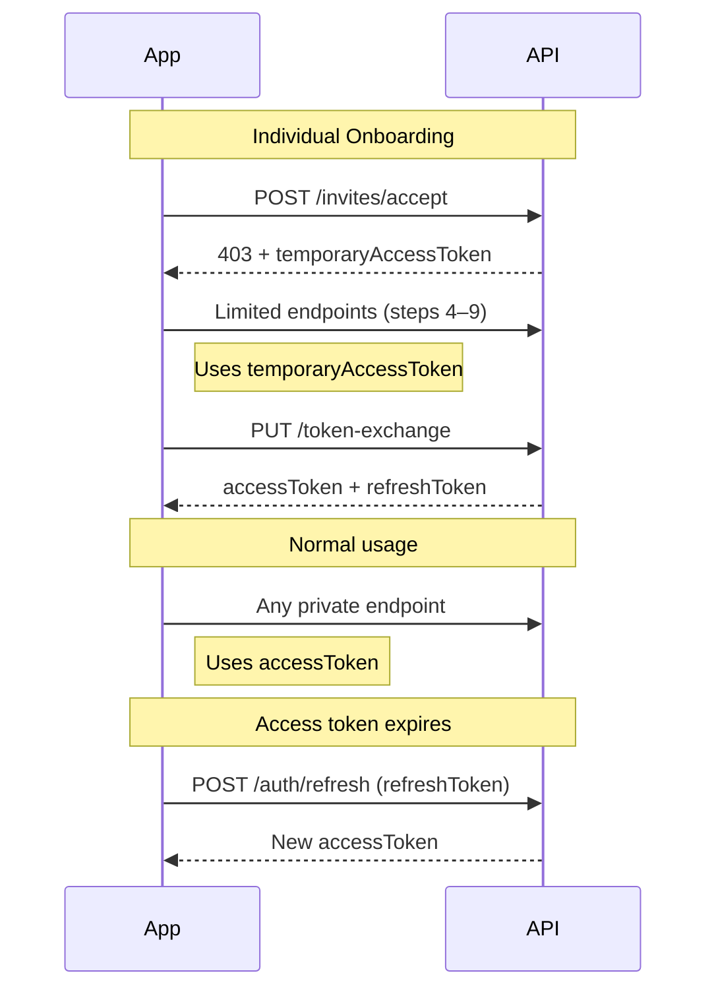

Every request to a private endpoint requires a valid Bearer token in the `Authorization` header.

```
Authorization: Bearer <your_token>
```

---

## Token Types

TAPP Cash uses two token types depending on where the user is in the flow.

| Token | Lifetime | Used for |
|-------|----------|----------|
| `accessToken` | 30 minutes | All private API calls after sign-in or token exchange |
| `refreshToken` | 30 days | Obtaining a new `accessToken` without re-login |
| `temporaryAccessToken` | Session | Individual user onboarding steps 4–9 only |

---

## Sign In

`POST /users/public/v1/auth/signin`

```json
{
  "login": "user@example.com",
  "password": "YourPassword123!",
  "roles": ["individual"]
}
```

Use `"roles": ["advisor"]` for account managers. Omit `roles` or use `["individual"]` for individual users.

**Response:**

```json
{
  "data": {
    "accessToken": "eyJ...",
    "refreshToken": "LUF..."
  }
}
```

---

## Refresh an Expired Access Token

`POST /users/public/v1/auth/refresh`

```json
{
  "refreshToken": "LUF..."
}
```

Returns a new `accessToken`. Call this automatically when any private endpoint returns `401`. Do not prompt the user to re-login unless the refresh token itself has expired.

---

## Get Current User Profile

`GET /users/private/v1/auth/me`

Returns the authenticated user's full profile using the current access token. Useful for confirming token validity and loading user context on app launch.

---

## Token Lifecycle



---

## Token Scopes

| Token | Accessible endpoints |
|-------|---------------------|
| Account manager `accessToken` | `/branches/private/*` — manage individuals, send invitations |
| Individual `accessToken` | `/accounts/private/*`, `/notifications/private/*`, `/kyc/private/*`, `/branches/private/v1/delete-profile*` |
| `temporaryAccessToken` | `/branches/private/v1/limited/*`, `/users/private/v1/limited/*` — onboarding steps only |

---

## Authentication Errors

| Status | Meaning | Fix |
|--------|---------|-----|
| `401` | Missing or expired `accessToken` | Refresh with `POST /auth/refresh` |
| `401` | Invalid `refreshToken` | Token expired — user must sign in again |
| `403` | Valid token but wrong role or endpoint | Check token type and endpoint visibility (`public` vs `private`) |
