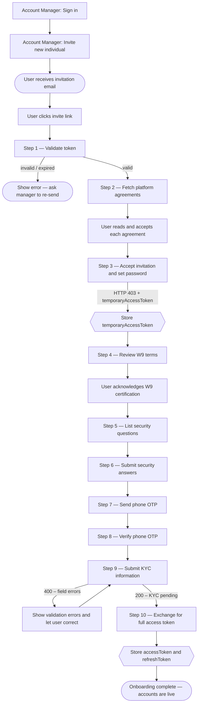

This section covers everything an individual user can do after receiving an account manager's invitation — from completing onboarding through daily banking operations.

---

## What can you do?

<div style="display:grid;grid-template-columns:1fr 1fr;gap:16px;margin:24px 0">

<div style="border:1px solid #e5e7eb;border-radius:8px;padding:20px">
<strong>Onboarding</strong><br/><br/>
Complete the 10-step flow: validate invite token, accept agreements, set password, W9, security questions, phone OTP, KYC, and token exchange.
</div>

<div style="border:1px solid #e5e7eb;border-radius:8px;padding:20px">
<strong>Accounts &amp; Balances</strong><br/><br/>
List all accounts, view available and pending balances per account, get total balance across accounts, and download monthly statements.
</div>

<div style="border:1px solid #e5e7eb;border-radius:8px;padding:20px">
<strong>Transactions</strong><br/><br/>
Full paginated transaction history with status filtering. View individual transaction details and download balance or transaction charts.
</div>

<div style="border:1px solid #e5e7eb;border-radius:8px;padding:20px">
<strong>Move Money</strong><br/><br/>
Internal transfers between the user's own accounts (TBA) and ACH pulls/pushes to linked external bank accounts via Plaid.
</div>

<div style="border:1px solid #e5e7eb;border-radius:8px;padding:20px">
<strong>Notifications</strong><br/><br/>
Unread count badge, full notification list, mark all as read, and mark individual notifications as read.
</div>

<div style="border:1px solid #e5e7eb;border-radius:8px;padding:20px">
<strong>KYC &amp; Account Closure</strong><br/><br/>
Check KYC verification status and handle the two-step OTP-confirmed account deletion flow.
</div>

</div>

---

## Full Onboarding Journey



---

## Onboarding Steps 1–10

### Step 1: Validate the invitation token

Before rendering any UI, confirm the invite link is still valid.

`GET /branches/public/v1/common/invites/check?token=<invite_token>`

- **Auth**: None
- **On success (200)**: Token is valid — proceed to step 2.
- **On error (400/404)**: Show "Invitation expired or not found."

---

### Step 2: Fetch platform agreements

`GET /branches/public/v1/common/agreements`

- **Auth**: None
- Display each agreement's title and content. Require the user to tick "I agree" for each before continuing.

---

### Step 3: Accept the invitation

`POST /branches/public/v1/individual/invites/accept`

```json
{
  "token": "<invite_token>",
  "password": "SecurePassword#2024",
  "confirmPassword": "SecurePassword#2024",
  "agreementIds": [1, 2, 3]
}
```

**On success (403 with body):**

```json
{
  "data": { "temporaryAccessToken": "eyJ..." },
  "errors": [{ "code": "required additional actions", "meta": { "fields": ["phoneNumber", "kyc"] } }]
}
```

> HTTP 403 here is intentional. Extract `data.temporaryAccessToken` and store it. Use it for steps 4–9. The `meta.fields` array tells you which steps are still required.

---

### Step 4: Show W9 terms

`GET /branches/private/v1/limited/w9/terms`

- **Auth**: Temporary token
- Display the W9 tax certification text. Record the timestamp of user acceptance for step 9.

---

### Step 5: List security questions

`GET /users/private/v1/limited/security-questions`

- **Auth**: Temporary token
- Present 3 questions for the user to choose and answer.

---

### Step 6: Submit security answers

`POST /users/private/v1/limited/security-questions/answers`

```json
{
  "answers": [
    { "questionId": 1, "answer": "Seattle" },
    { "questionId": 5, "answer": "Buddy" },
    { "questionId": 9, "answer": "Blue" }
  ]
}
```

- **Auth**: Temporary token. Exactly 3 distinct question IDs required.

---

### Step 7: Send phone OTP

`POST /users/private/v1/limited/generate-new-phone-code`

- **Auth**: Temporary token
- Triggers an SMS to the phone number registered during invitation.

---

### Step 8: Verify phone OTP

`PUT /users/private/v1/limited/check-phone-code`

```json
{ "code": "ABC12" }
```

- **Auth**: Temporary token. On success, the phone is confirmed.

---

### Step 9: Submit KYC information

`POST /branches/private/v1/limited/individual/signup`

```json
{
  "dateOfBirth": "1990-03-20",
  "socialSecurityNumber": "987-65-4321",
  "usCitizenshipStatus": "Citizen",
  "address": {
    "address": "123 Main Street",
    "city": "New York",
    "state": "NY",
    "zipCode": "10001",
    "country": "US"
  },
  "w9": {
    "isSubjectToBackupWithholding": false,
    "accepted": true,
    "timestamp": "2024-03-15T14:22:00Z"
  },
  "employment": {
    "status": "employed",
    "employer": "Acme Corp",
    "occupation": "Engineer"
  },
  "transferActivity": {
    "expectedMonthlyTransactions": 10,
    "expectedMonthlyVolume": "5000.00"
  }
}
```

- **Auth**: Temporary token
- **On success (200)**: KYC submitted, processing asynchronously.
- **On error (400)**: Check `errors` array for field-level failures.

---

### Step 10: Exchange temporary token for full access

`PUT /users/private/v1/limited/token-exchange`

- **Auth**: Temporary token

```json
{
  "data": {
    "accessToken": "eyJ...",
    "refreshToken": "LUF..."
  }
}
```

Store both tokens. Onboarding is complete and the user's accounts are immediately available.

---

## Accounts & Balances

### List all accounts

`GET /accounts/private/v1/account`

- **Auth**: Individual access token
- Returns all accounts owned by the authenticated user. Accounts are created automatically during onboarding and are immediately available after token exchange.

**Response:**

```json
{
  "data": [
    {
      "id": 1001,
      "name": "Checking Account",
      "type": "checking",
      "status": "active",
      "currency": "USD",
      "availableBalance": "2450.00",
      "pendingBalance": "150.00"
    },
    {
      "id": 1002,
      "name": "Savings Account",
      "type": "savings",
      "status": "active",
      "currency": "USD",
      "availableBalance": "8800.00",
      "pendingBalance": "0.00"
    }
  ]
}
```

| Field | Description |
|-------|-------------|
| `id` | Account ID used in transfer requests |
| `name` | Display name shown to the user |
| `type` | Account type: `checking`, `savings` |
| `status` | `active`, `frozen`, or `closed` |
| `availableBalance` | Funds available for immediate use |
| `pendingBalance` | Funds held from pending transactions |

---

### Get account details

`GET /accounts/private/v1/account/{id}`

Returns the full account object including available balance, account type, interest configuration, and account number details.

---

### Total balance across all accounts

`GET /accounts/private/v1/balance/total`

- **Auth**: Individual access token
- Returns the combined balance across all accounts, including pending amounts.

**Response:**

```json
{
  "data": {
    "totalAvailableBalance": "11250.00",
    "pendingIncoming": "500.00",
    "pendingOutgoing": "150.00",
    "currency": "USD"
  }
}
```

| Field | Description |
|-------|-------------|
| `totalAvailableBalance` | Sum of available balances across all accounts |
| `pendingIncoming` | Total funds incoming but not yet settled |
| `pendingOutgoing` | Total funds outgoing but not yet settled |

Pass `?accountIds=1001,1002` to filter to specific accounts.

---

### Transaction history

`GET /accounts/private/v1/transactions`

- **Auth**: Individual access token
- Returns a paginated list of transactions with status, amount, and counterparty.

**Response:**

```json
{
  "data": [
    {
      "id": "txn_abc123",
      "type": "tba",
      "status": "executed",
      "amount": "100.00",
      "currency": "USD",
      "description": "Savings top-up",
      "createdAt": "2024-03-15T14:22:00Z"
    }
  ],
  "meta": {
    "totalRecord": 45,
    "totalPage": 3,
    "pageNumber": 1,
    "limit": 20
  }
}
```

**Filter by status:**

```
?filter[status:eq]=executed
?filter[status:in]=pending,executed
```

| Status | Meaning |
|--------|---------|
| `pending` | Submitted, awaiting processing |
| `executed` | Completed successfully |
| `rejected` | Failed — see transaction details |

---

### Monthly statement

`GET /accounts/private/v1/account/{id}/statement/{year}/{month}`

Generates and returns a downloadable monthly statement PDF for the specified account and month.
